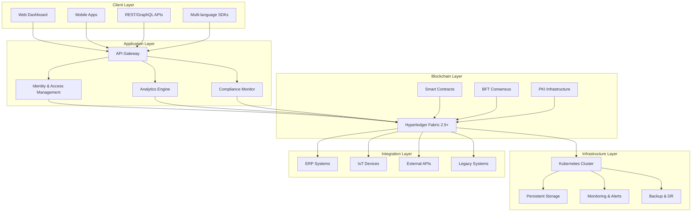

# Enterprise Hyperledger Fabric Supply Chain Platform

[](https://opensource.org/licenses/Apache-2.0)
[](https://hyperledger-fabric.readthedocs.io/)
[]()
[]()

> **🚧 TRANSFORMATION IN PROGRESS**  
> This repository is undergoing a comprehensive transformation from demonstration code to production-ready enterprise platform. The current v1.1 implementation serves as a foundation while we build toward v2.5+ production readiness.

## 🌟 Vision Statement

Transform global supply chain operations through a production-ready, enterprise-grade blockchain platform built on Hyperledger Fabric 2.5+. This platform enables end-to-end traceability, regulatory compliance, and operational excellence for manufacturers, suppliers, and logistics providers worldwide.

---

## 📋 Table of Contents

- [🎯 Executive Summary](#-executive-summary)
- [🏗️ Architecture Overview](#️-architecture-overview)
- [🚀 Getting Started](#-getting-started)
- [📊 Current Status & Roadmap](#-current-status--roadmap)
- [🔧 Core Features](#-core-features)
- [🛡️ Security & Compliance](#️-security--compliance)
- [📈 Performance & Scalability](#-performance--scalability)
- [🔌 Integration Capabilities](#-integration-capabilities)
- [📚 Documentation](#-documentation)
- [🤝 Contributing](#-contributing)
- [📄 License](#-license)

---

## 🎯 Executive Summary

### Current State (v1.1 - Demo)

⚠️ **FOR DEMONSTRATION PURPOSES ONLY - NOT PRODUCTION READY**

The existing codebase demonstrates basic supply chain concepts using Hyperledger Fabric v1.1, including:

- Basic car component tracking
- Simple smart contract operations
- Proof-of-concept network configuration
- Limited security implementation

### Target State (v2.5+ - Production)

🎯 **ENTERPRISE-GRADE SUPPLY CHAIN PLATFORM**

Comprehensive transformation delivering:

- **Latest Hyperledger Fabric 2.5+** with advanced features
- **Multi-industry support** (Automotive, Electronics, Pharmaceuticals, Food & Beverage)
- **Enterprise security** with end-to-end encryption and compliance
- **Kubernetes-native deployment** with auto-scaling
- **10,000+ TPS performance** with sub-second latency
- **99.9% uptime SLA** capability
- **Regulatory compliance** (GDPR, SOX, FDA, FSMA)

---

## 🏗️ Architecture Overview

### High-Level Architecture



### Technology Stack

| Layer               | Technology         | Version | Purpose                       |
| ------------------- | ------------------ | ------- | ----------------------------- |
| **Blockchain**      | Hyperledger Fabric | 2.5+    | Core blockchain platform      |
| **Consensus**       | SmartBFT/ARMA      | Latest  | Byzantine fault tolerance     |
| **Smart Contracts** | Go/JavaScript      | Latest  | Business logic implementation |
| **Orchestration**   | Kubernetes         | 1.25+   | Container orchestration       |
| **Service Mesh**    | Istio              | 1.15+   | Service communication         |
| **Monitoring**      | Prometheus/Grafana | Latest  | Metrics and alerting          |
| **Logging**         | ELK Stack          | Latest  | Centralized logging           |
| **CI/CD**           | GitOps/ArgoCD      | Latest  | Automated deployment          |
| **Security**        | Vault/Cert-Manager | Latest  | Secret management             |

---

## 🚀 Getting Started

### Prerequisites

```bash
# Required software versions
- Docker 20.10+
- Kubernetes 1.25+
- Helm 3.8+
- Go 1.19+
- Node.js 18+
- Python 3.9+
```

### Quick Start (Development)

```bash
# Clone the repository
git clone https://github.com/your-org/hlfsupplychain.git
cd hlfsupplychain

# Install dependencies
make install-deps

# Start development environment
make dev-up

# Run tests
make test

# View status
make status
```

### Production Deployment

```bash
# Deploy to Kubernetes cluster
helm install supply-chain ./charts/hyperledger-fabric \
  --namespace supply-chain \
  --create-namespace \
  --values production-values.yaml

# Verify deployment
kubectl get pods -n supply-chain
```

---

## 📊 Current Status & Roadmap

### Project Phases

#### 🏗️ Phase 1: Foundation (Months 1-3)

**Status: In Progress** 🚧

- [x] Project initialization and planning
- [x] TaskMaster setup and PRD creation
- [ ] Hyperledger Fabric v2.5+ upgrade
- [ ] Core security implementation
- [ ] Basic CI/CD pipeline
- [ ] Architecture documentation

#### 🔧 Phase 2: Core Features (Months 4-6)

**Status: Planned** 📋

- [ ] Advanced smart contract development
- [ ] API layer implementation
- [ ] Monitoring and alerting
- [ ] Multi-industry templates
- [ ] Security audit framework

#### 🚀 Phase 3: Enterprise Features (Months 7-9)

**Status: Planned** 📋

- [ ] Advanced analytics dashboard
- [ ] Integration framework
- [ ] Performance optimization
- [ ] Compliance automation
- [ ] Mobile application support

#### ✅ Phase 4: Production Readiness (Months 10-12)

**Status: Planned** 📋

- [ ] Comprehensive testing
- [ ] Documentation completion
- [ ] Production deployment
- [ ] Go-live support
- [ ] Post-launch optimization

### Current Progress

```
Overall Progress: ████░░░░░░ 15%

├── Infrastructure Modernization:     ████░░░░░░ 20%
├── Security Implementation:          ██░░░░░░░░ 10%
├── Smart Contract Development:       █░░░░░░░░░ 5%
├── API Development:                  ░░░░░░░░░░ 0%
├── Testing & QA:                     █░░░░░░░░░ 5%
└── Documentation:                    ███░░░░░░░ 30%
```

---

## 🔧 Core Features

### 🌍 Multi-Industry Support

| Industry            | Use Cases                             | Compliance     |
| ------------------- | ------------------------------------- | -------------- |
| **Automotive**      | Parts traceability, Recall management | ISO/TS 16949   |
| **Electronics**     | Component sourcing, Conflict minerals | IPC Standards  |
| **Pharmaceuticals** | Drug traceability, Cold chain         | FDA, GxP       |
| **Food & Beverage** | Food safety, Origin tracking          | FSMA, HACCP    |
| **Textiles**        | Ethical sourcing, Sustainability      | GOTS, OEKO-TEX |

### 🔐 Advanced Security Features

- **End-to-End Encryption**: AES-256 for all data transmission
- **Zero-Knowledge Proofs**: Privacy-preserving verification
- **Post-Quantum Cryptography**: Future-proof security
- **Multi-Factor Authentication**: Enterprise-grade access control
- **Audit Trails**: Immutable transaction logging

### 📊 Smart Contract Capabilities

```go
// Example: Enhanced Product Lifecycle Management
type Product struct {
    ID              string    `json:"id"`
    Name            string    `json:"name"`
    Category        string    `json:"category"`
    Manufacturer    string    `json:"manufacturer"`
    Components      []Component `json:"components"`
    Certifications  []Certification `json:"certifications"`
    Sustainability  SustainabilityMetrics `json:"sustainability"`
    Compliance      ComplianceStatus `json:"compliance"`
    CreatedAt       time.Time `json:"created_at"`
    UpdatedAt       time.Time `json:"updated_at"`
}

// Advanced traceability with multi-tier supplier support
func (cc *SmartContract) TraceProductOrigin(ctx contractapi.TransactionContextInterface,
    productID string, depth int) (*TraceabilityReport, error) {
    // Implementation for comprehensive supply chain tracing
}
```

---

## 🛡️ Security & Compliance

### Security Framework

- **Identity Management**: Integration with enterprise identity providers
- **Access Control**: Role-based permissions with dynamic updates
- **Data Protection**: GDPR/CCPA compliant data handling
- **Network Security**: TLS 1.3, certificate pinning
- **Incident Response**: Automated threat detection and response

### Compliance Standards

| Standard         | Status         | Coverage               |
| ---------------- | -------------- | ---------------------- |
| **SOC2 Type II** | 🚧 In Progress | Security, Availability |
| **ISO 27001**    | 📋 Planned     | Information Security   |
| **GDPR**         | 🚧 In Progress | Data Protection        |
| **HIPAA**        | 📋 Planned     | Healthcare Data        |
| **SOX**          | 📋 Planned     | Financial Controls     |

### Security Architecture

```yaml
# Security layers implementation
security:
  encryption:
    at_rest: "AES-256"
    in_transit: "TLS 1.3"
    application: "End-to-end"

  authentication:
    methods: ["MFA", "SSO", "Certificate"]
    providers: ["LDAP", "SAML", "OAuth2"]

  authorization:
    model: "RBAC + ABAC"
    policies: "Dynamic + Context-aware"

  monitoring:
    siem: "Real-time threat detection"
    audit: "Immutable blockchain logs"
    compliance: "Automated reporting"
```

---

## 📈 Performance & Scalability

### Performance Targets

| Metric                     | Target      | Current     | Status        |
| -------------------------- | ----------- | ----------- | ------------- |
| **Transaction Throughput** | 10,000+ TPS | ~100 TPS    | 🚧 Upgrading  |
| **Transaction Latency**    | <1 second   | ~5 seconds  | 🚧 Optimizing |
| **Network Uptime**         | 99.9%       | ~95%        | 🚧 Improving  |
| **Node Recovery Time**     | <5 minutes  | ~30 minutes | 🚧 Enhancing  |

### Scalability Features

- **Horizontal Scaling**: Auto-scaling peer nodes
- **Load Balancing**: Intelligent request distribution
- **Caching**: Multi-layer caching strategy
- **Database Optimization**: Sharding and indexing
- **CDN Integration**: Global content delivery

### Performance Optimization

```yaml
# Fabric-X configuration for high throughput
performance:
  consensus:
    algorithm: "ARMA-BFT"
    batch_size: 1000
    timeout: "1s"

  peers:
    parallel_validation: true
    cache_size: "1GB"
    db_type: "CouchDB-Optimized"

  chaincode:
    execution: "parallel"
    resources:
      cpu: "2 cores"
      memory: "4GB"
```

---

## 🔌 Integration Capabilities

### Enterprise System Integration

| System Type             | Integration Method  | Status     |
| ----------------------- | ------------------- | ---------- |
| **ERP Systems**         | REST API + Webhooks | 📋 Planned |
| **WMS/TMS**             | Real-time sync      | 📋 Planned |
| **IoT Platforms**       | MQTT/CoAP protocols | 📋 Planned |
| **Financial Systems**   | Secure API gateways | 📋 Planned |
| **Document Management** | File handling APIs  | 📋 Planned |

### API Documentation

```yaml
# OpenAPI 3.0 specification
openapi: 3.0.0
info:
  title: Supply Chain Platform API
  description: Enterprise-grade supply chain management
  version: "2.0.0"

paths:
  /api/v2/products:
    get:
      summary: List products
      security:
        - BearerAuth: []
      parameters:
        - name: category
          in: query
          schema:
            type: string
      responses:
        "200":
          description: Product list
          content:
            application/json:
              schema:
                $ref: "#/components/schemas/ProductList"
```

---

## 📚 Documentation

### Documentation Structure

```
docs/
├── architecture/
│   ├── system-design.md
│   ├── security-architecture.md
│   └── deployment-guide.md
├── api/
│   ├── rest-api.md
│   ├── graphql-schema.md
│   └── sdk-reference.md
├── operations/
│   ├── installation.md
│   ├── monitoring.md
│   └── troubleshooting.md
├── development/
│   ├── smart-contracts.md
│   ├── testing.md
│   └── contribution-guide.md
└── compliance/
    ├── security-policies.md
    ├── audit-procedures.md
    └── regulatory-mapping.md
```

### Quick Links

- 📖 [Architecture Documentation](./docs/architecture/)
- 🔧 [API Reference](./docs/api/)
- 🚀 [Deployment Guide](./docs/operations/installation.md)
- 👨‍💻 [Developer Guide](./docs/development/)
- 🛡️ [Security Policies](./docs/compliance/security-policies.md)

---

## 🤝 Contributing

We welcome contributions from the community! This project follows enterprise-grade development practices.

### Development Workflow

```bash
# Fork and clone the repository
git clone https://github.com/YOUR-USERNAME/hlfsupplychain.git

# Create feature branch
git checkout -b feature/your-feature-name

# Make changes and test
make test
make lint
make security-scan

# Submit pull request
git push origin feature/your-feature-name
```

### Contribution Guidelines

- 📋 **Issues**: Use issue templates for bugs and features
- 🔀 **Pull Requests**: Follow PR template and guidelines
- 🧪 **Testing**: Maintain 90%+ code coverage
- 📝 **Documentation**: Update docs for all changes
- 🔒 **Security**: Follow secure coding practices

### Code Standards

| Language       | Linter        | Coverage | Security   |
| -------------- | ------------- | -------- | ---------- |
| **Go**         | golangci-lint | 90%+     | gosec      |
| **JavaScript** | ESLint        | 90%+     | npm audit  |
| **Python**     | pylint        | 90%+     | safety     |
| **YAML**       | yamllint      | N/A      | kube-score |

---

## 📄 License

This project is licensed under the Apache License 2.0 - see the [LICENSE](LICENSE) file for details.

```
Copyright 2024 Enterprise Supply Chain Platform

Licensed under the Apache License, Version 2.0 (the "License");
you may not use this file except in compliance with the License.
You may obtain a copy of the License at

    http://www.apache.org/licenses/LICENSE-2.0

Unless required by applicable law or agreed to in writing, software
distributed under the License is distributed on an "AS IS" BASIS,
WITHOUT WARRANTIES OR CONDITIONS OF ANY KIND, either express or implied.
See the License for the specific language governing permissions and
limitations under the License.
```

---

## 🚨 Important Notices

### ⚠️ Current Development Status

This repository is undergoing active transformation from demonstration code to production-ready platform. Current code should **NOT** be used in production environments.

### 🔒 Security Disclaimer

While we implement enterprise-grade security measures, always conduct your own security audit before production deployment. Report security vulnerabilities through our [security policy](./SECURITY.md).

### 📞 Support & Contact

- 🐛 **Bug Reports**: [GitHub Issues](https://github.com/your-org/hlfsupplychain/issues)
- 💡 **Feature Requests**: [GitHub Discussions](https://github.com/your-org/hlfsupplychain/discussions)
- 📧 **Enterprise Support**: enterprise-support@your-org.com
- 💬 **Community Chat**: [Discord](https://discord.gg/your-channel)

---

<div align="center">

**🌟 Building the Future of Supply Chain Management 🌟**

Made with ❤️ by the Enterprise Supply Chain Platform Team

</div>
